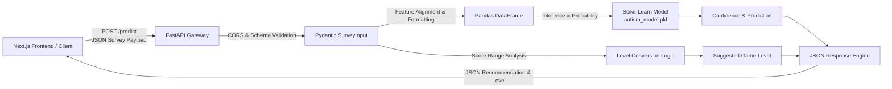

# 🧠 LumoBuddy ML API — Developmental Screening & Recommendation Engine

<div align="center">


<p align="center">
  <strong>High-performance, containerized Machine Learning microservice powering intelligent screening classification and adaptive gameplay level recommendations for the LumoBuddy child development platform.</strong>
</p>

[Key Features](#-key-features) •
[Architecture & Data Flow](#-architecture--data-flow) •
[API Endpoints](#-api-endpoints) •
[Quick Start](#-quick-start) •
[Docker Deployment](#-docker-deployment) •
[Cloud Hosting](#-cloud-deployment) •
[Frontend Integration](#-frontend-integration)

</div>

---

> [!IMPORTANT]
> **Ethical & Purpose Disclaimer**: This API and its underlying machine learning model serve as an **assistive educational screening and developmental personalization tool**, not a clinical diagnostic device. The predictions and suggested gameplay levels are designed to adapt educational content to a child's current pace and support parents and educators with objective progress metrics. It does not replace clinical evaluation by licensed medical professionals.

---

## 📖 Overview

The **LumoBuddy ML API** is the computational backbone of the LumoBuddy ecosystem. While the front-end provides calm, sensory-friendly interactive games and questionnaires, this service processes multi-dimensional developmental survey responses (emotion, cognition, self-awareness, math, and composite scores) to:

1. **Evaluate Developmental Screening Metrics**: Infer classification patterns using a trained Scikit-Learn model (`autism_model.pkl`).
2. **Compute Confidence Probabilities**: Estimate statistical certainty on assessment predictions.
3. **Recommend Adaptive Game Levels**: Dynamically map aggregate scoring metrics into structured game difficulty levels (Level 1: Foundation, Level 2: Intermediate, Level 3: Advanced) to ensure every child plays at an optimal challenge level.

---

## ✨ Key Features

- **⚡ Blazing Fast Asynchronous API**: Built with **FastAPI** and powered by **Uvicorn ASGI**, ensuring low latency and high request throughput.
- **🎯 Deterministic & Adaptive Level Mapping**: Translates raw developmental screening metrics into actionable game progression tiers.
- **🛡️ Built-in CORS Support**: Pre-configured cross-origin middleware to communicate smoothly with Next.js, React, or mobile clients.
- **📦 Production-Ready Containerization**: Optimized Dockerfile with minimal footprint using `python:3.10-slim` and dynamic port binding (`${PORT:-10000}`).
- **☁️ Multi-Cloud Deployment Ready**: Native configurations for **Render** (`render.yaml`) and **Vercel** (`vercel.json`), plus standard container/VPS hosting.
- **📚 Interactive OpenAPI Documentation**: Automated Swagger UI (`/docs`) and ReDoc (`/redoc`) for immediate interactive testing and exploration.

---

## 🏗️ Architecture & Data Flow



---

## 🗂️ Project Structure

```text
lumo_buddy_ml_api/
├── model/
│   └── autism_model.pkl     # Pre-trained ML model package (model + feature names)
├── main.py                  # FastAPI application, routing, CORS, and prediction logic
├── requirements.txt         # Python package dependencies
├── Dockerfile               # Production container image configuration
├── render.yaml              # Render blueprint deployment specification
├── vercel.json              # Vercel serverless deployment specification
├── .gitignore               # Ignored files (virtual environments, caches, OS files)
└── README.md                # Project documentation
```

---

## 📡 API Endpoints

### 1. Health Check
Verifies service uptime and readiness.

- **Route:** `GET /`
- **Response Headers:** `Content-Type: application/json`
- **Example Response:**
  ```json
  {
    "status": "running",
    "message": "LUMO BUDDY ML API is working"
  }
  ```

---

### 2. Predict Screening & Game Level
Processes survey responses, computes model inference with confidence, and assigns the recommended gameplay tier.

- **Route:** `POST /predict`
- **Content-Type:** `application/json`

#### Request Body Schema (`SurveyInput`)
| Field | Type | Description |
| :--- | :--- | :--- |
| `emotion_score` | `integer` | Assessment score for emotional recognition and regulation |
| `cognitive_score` | `integer` | Assessment score for attention, memory, and problem solving |
| `self_awareness_score` | `integer` | Assessment score for body and self-awareness |
| `math_score` | `integer` | Assessment score for numeracy and counting tasks |
| `total_score` | `integer` | Aggregate developmental score across all dimensions |

#### Example Request Payload
```json
{
  "emotion_score": 15,
  "cognitive_score": 18,
  "self_awareness_score": 12,
  "math_score": 14,
  "total_score": 59
}
```

#### Example Response Payload
```json
{
  "screening_prediction": 1,
  "predicted_level": 2,
  "confidence": 0.88,
  "recommendation": "Suggested game level: Level 2"
}
```

#### Developmental Level Mapping Breakdown
| Total Score Range | Assigned Level | Focus Area |
| :---: | :---: | :--- |
| `≤ 40` | **Level 1** | Foundation skills, gentle sensory feedback, single-step prompts |
| `41 - 85` | **Level 2** | Intermediate challenges, pattern matching, guided independence |
| `> 85` | **Level 3** | Advanced problem solving, multi-step tasks, free exploration |

---

## 🚀 Quick Start (Local Development)

### Prerequisites
- **Python 3.10+** installed
- **Git** installed

### 1. Clone the Repository
```bash
git clone https://github.com/OshanKothalawala/lumobuddy-back-end.git
cd lumobuddy-back-end
```

### 2. Create and Activate a Virtual Environment

**On Windows (PowerShell):**
```powershell
python -m venv venv
.\venv\Scripts\Activate.ps1
```

**On macOS / Linux:**
```bash
python3 -m venv venv
source venv/bin/activate
```

### 3. Install Dependencies
```bash
pip install --upgrade pip
pip install -r requirements.txt
```

### 4. Run the Development Server
```bash
uvicorn main:app --host 127.0.0.1 --port 8000 --reload
```

The API will now be running at:
- **Root Service**: [http://127.0.0.1:8000](http://127.0.0.1:8000)
- **Interactive Swagger Docs**: [http://127.0.0.1:8000/docs](http://127.0.0.1:8000/docs)
- **Alternative ReDoc**: [http://127.0.0.1:8000/redoc](http://127.0.0.1:8000/redoc)

### 5. Test with cURL or PowerShell

**Using cURL:**
```bash
curl -X POST "http://127.0.0.1:8000/predict" \
     -H "Content-Type: application/json" \
     -d "{\"emotion_score\": 15, \"cognitive_score\": 18, \"self_awareness_score\": 12, \"math_score\": 14, \"total_score\": 59}"
```

**Using PowerShell:**
```powershell
$body = @{
    emotion_score = 15
    cognitive_score = 18
    self_awareness_score = 12
    math_score = 14
    total_score = 59
} | ConvertTo-Json

Invoke-RestMethod -Uri "http://127.0.0.1:8000/predict" -Method Post -Body $body -ContentType "application/json"
```

---

## 🐳 Docker Deployment

The application includes an optimized, lightweight container specification.

### 1. Build the Docker Image
```bash
docker build -t lumobuddy-ml-api:latest .
```

### 2. Run the Container
```bash
docker run -d -p 10000:10000 --name lumobuddy-ml-service lumobuddy-ml-api:latest
```

The service will be accessible at `http://localhost:10000`.

---

## ☁️ Cloud Deployment

### Option A: Render (Recommended)
This repository includes a `render.yaml` blueprint:
1. Connect your GitHub repository to [Render](https://render.com).
2. Create a new **Web Service** from the repo, or use the **Blueprint** option.
3. Render will automatically detect `render.yaml` and the `Dockerfile`:
   - **Environment:** Docker
   - **Plan:** Free
   - **Health Check Path:** `/`
   - **Port:** Defaults dynamically to `$PORT` (10000).

### Option B: Vercel
A `vercel.json` file is included for serverless execution:
1. Import the repository into your [Vercel](https://vercel.com) dashboard.
2. Vercel uses `@vercel/python` to mount `main.py` routes automatically.

---

## 🔗 Frontend Integration

To connect this ML microservice to the **LumoBuddy Front-End** (Next.js), configure the backend endpoint in your front-end `.env.local` file:

```env
# Point to your local server during development
NEXT_PUBLIC_ML_API_URL=http://127.0.0.1:8000

# Or point to your deployed cloud service in production
# NEXT_PUBLIC_ML_API_URL=https://lumo-buddy-ml-api.onrender.com
```

In your Next.js application, make requests directly to `/predict`:

```typescript
const response = await fetch(`${process.env.NEXT_PUBLIC_ML_API_URL}/predict`, {
  method: "POST",
  headers: { "Content-Type": "application/json" },
  body: JSON.stringify({
    emotion_score: scores.emotion,
    cognitive_score: scores.cognitive,
    self_awareness_score: scores.selfAwareness,
    math_score: scores.math,
    total_score: scores.total,
  }),
});

const result = await response.json();
console.log("Recommended Game Level:", result.predicted_level);
```

---

## 📦 Dependencies

| Package | Purpose |
| :--- | :--- |
| **`fastapi`** | Modern, high-performance web framework for building APIs |
| **`uvicorn`** | Lightning-fast ASGI web server implementation |
| **`pandas`** | Data alignment and tabular structure preparation for the model |
| **`scikit-learn`** | Machine learning evaluation and probabilistic inference |
| **`joblib`** | Fast serialization and deserialization of the trained model artifact |

---

## 🤝 Related Repositories

- 🌐 **Frontend Application**: [lumobuddy-front-end](https://github.com/OshanKothalawala/lumobuddy-front-end) — Sensory-friendly Next.js web application with interactive learning games, parent questionnaires, and clinical analytics.

---

## 📄 License

This project is licensed under the [MIT License](LICENSE) — see the LICENSE file for details.